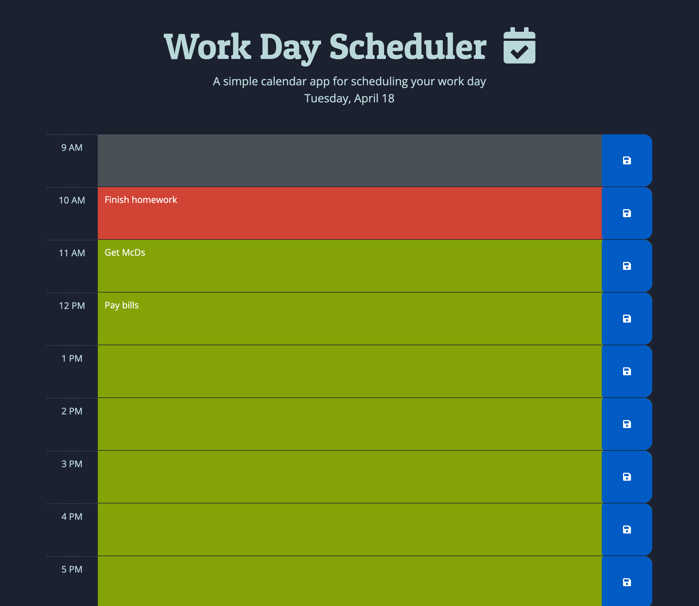

# Third-Party APIs: Work Day Scheduler
## Description
A simple calendar application that allows a user to save events for each hour of the day. This app will run in the browser and feature dynamically updated HTML and CSS powered by jQuery.
## Installation
N/A
## Usage
Open [this website](https://skywalkah.github.io/work-day-scheduller/) in Chrome. Click any of the time slots to add a task. Then click on the blue button to save. Refresh page to check wether it was saved. Open Developer tools console to look for errors. Make sure to test this application between 9am and 5pm to see all colors. If you check this app before 9am, all slots will be green, indicating they are in the future. If you check it after 5pm, all slots will be grey, indicating they are in the past.
## What it should look like

## Credits
N/A

## License
MIT license - Please refer to the LICENSE in the repo for more info.
